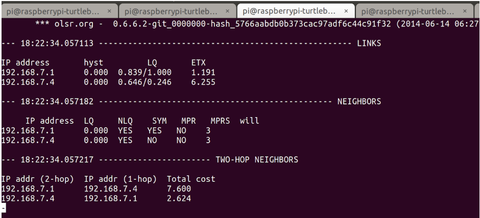

**Background:** 
I am doing research on Campus at USC's Autonomous Networks Research Group. We're working on coordinated localization of robots related to the DARPA SubT challenge (https://www.darpa.mil/program/darpa-subterranean-challenge)
In order to allow devices to communicate over longer distance and multiple hops, naturally we had to set up a mesh network. 
The one in this tutorial is WiFi based, but I am definitely interested in replicating this using Radios. 

I cannot guarantee that all of the steps will be the same if you do not have the same operating system on your Raspberry Pi. For this reason, step one will be setting up the same OS that I was using. 

The basic idea of my configuration is to automatically rejoin your local wifi network when your Pi boots up. Then if you want to go into AdHoc mode, you can use the shell scripts provided

If you are interested in reading about Ad-Hoc networks and OLSR, here are some resources to get you started:

- Ad Hoc Networks: https://www.techopedia.com/definition/5868/ad-hoc-network
- OLSR: http://www.olsr.org/mediawiki/index.php/Main_Page
- wikipedia!!

---------------- Tutorial on how to setup Raspberry Pi with OLSRd mesh network ---------------

**Hardware required:**

- Raspberry Pi

- MicroSD card

- Wifi USB dongle. The one I used is available on Amazon Prime for about $10

	https://www.amazon.com/Wifi-Antenna-Raspberry-Pi-Instructions/dp/B00H95C0A2?ref_=ast_bbp_dp
	you need 1 per RPi + 1 for your laptop 
- Micro USB to power your Raspberry Pi

- PC (I was using Ubuntu 18.04)

**Description of Files:**

Files for the RPi:

- config_ad_hoc.sh : configuration for ad_hoc network on your wireless interface. The provided script does this on wlan1. 
make sure to change the IP address for each unique device in this file

- start_olsrd.sh : Once you have configured your interface using config_ad_hoc.sh, you can run this to start olsrd

- restart_networking.sh - Should reconnect you to your local home wifi network. 

- rc.local : this file runs on boot. I have edited it to start "normal" networking on your Pi at boot, so you will automatically connect to a normal (non AdHoc) wifi network

Files for your Ubuntu PC:

- pc_adhoc.sh : configures your wireless interface your adhoc networking

- pc_restart_networking.sh : Should reconnect you to your local home wifi network. 

- pc_start_olsrd.sh : Once you have configured your interface using config_ad_hoc.sh, you can run this to start olsrd

**Step 1: Raspbian Setup**

Follow the guide on this webpage : 

	http://emanual.robotis.com/docs/en/platform/turtlebot3/raspberry_pi_3_setup/#install-linux-based-on-raspbian

If you would like to setup your Raspberry Pi in Headless mode, all you need to do is configure your WiFi settings and allow for ssh. This is easy to do if your PC is running Ubuntu

There are tons of guides on how to do this online. Here is one that I find is pretty clear:

	https://howtoraspberrypi.com/how-to-raspberry-pi-headless-setup/

Also at this point, you should change the hostname of your raspberry pi. You will need to do this if you plan on having more than one RPi in your mesh network. 

**Step 2: SSH into your Pi**

	username pi
	password turtlebot

If this does not work for you, its possible your configuration is wrong. Don't dwell on this. Just connect your Pi to an HDMI monitor, USB keyboard, and USB mouse, and do all configuration using the GUI which you can access using 

	sudo raspi-config

Feel free to change your pi password. Open the RPi settings using 

	sudo raspi-config

**Step 3: Install OLSRd**
Once you are ssh'd into your Raspberry Pi and connected to your WiFi network, run the following commands: 

	sudo apt-get update
	sudo apt-get install olsrd
	
resource: https://www.raspberrypi.org/forums/viewtopic.php?t=103550

**Step 4: Figure out the name of your WiFi interface related to your USB WiFi dongle.**

to do this you can run this command with the WiFi dongle disconnected:
	
	iwconfig

On my RPi 3B+, the only wireless interface available was wlan0

After plugging in the WiFi dongle, run the command

	iwconfig

On my RPi 3B+, a new wireless interface showed up: wlan1. This is what I used in all of my configuration files

NOTE: If your USB dongle wireless interface is not wlan1, you will need to edit basically all of the files that I have attached here. Just replace wlan1 with the name of your wireless interface. 

**Step 5: Copy the Shell Scripts onto your Raspberry Pi**
You can do this using scp, an scp helper like FileZilla, or by creating the files and copy pasting my files into your RPi.
	
	*** the most important file to copy over is /etc/rc.local *** 
	The lines added in this file will restart your network manager, allowing you to connect to your pi via your home wifi network on boot. 

Next you can copy over the shell scripts. I have mine in /Documents/shell_scripts
Just move the entire directory over to Documents, or wherever you want them

	-- in the shell script config_ad_hoc.sh, make sure to give each device a unique IP address in the same subnet

edit the /etc/olsrd/olsrd.conf file provided. I attached mine, but yours could be different depending on the subnet or IP addresses you want to use.  I indicated in comments in this file where I made changes and instructions on what changes you might have to make. 

	you can search in the provided file for "EDIT MADE HERE"

I tried to make every edit to the file easy to find. 

**Step 6: Make the shell scripts executable**
On your RPi, navigate to the shell scripts directory. 
run the command:

	sudo chmod +x <file_name> 
for each of the shell scripts. this way you will be able to use them. 

**Step 7: Copy the files in pc_scripts to your Ubuntu PC and make them executable**
download the zip of this repo, or do a git clone ...

To make files executable:

	sudo chmod +x <file_name> 

**Step 8: Run the config_ad_hoc.sh on your RPi**
from the shell scripts directory, run this command:

	./config_ad_hoc.sh

at this point you will lose your ssh connection to your pi because your pi and your laptop are on different networks

Do this for all of the Pi's you want on your mesh network. 

**Step 9: Run pc_adhoc.sh**
Note: make sure that you edit this file and input your wireless interface name as we did for the RPi in previous steps

	./pc_adhoc.sh

**Step 10: SSH back into you RPi's**
You will need to use the Pi's IP address that you assigned it. 

ssh pi@pi'sIPAddress
For instance, to ssh into the pi at the IP address I have mine configured to in config_ad_hoc.sh: 

	ssh pi@192.168.7.3

**Step 11: Start OLSRd on your Pi's**
from the pi's shell scripts director

	./start_olsrd.sh

**Step 12: Start OLSRd on your PC**

	./pc_start_olsrd.sh

You are all done, you should see this screen: 

To reconnect to your home wifi network. Run the restart_networking shell scripts. 

If you want to see multi-hopping work without having to go too far, you can decrease the Tx Power on your wifi antenna using the following command:
iwconfig wlan1 txpower 0
